# Tuning Guide for AI on the 4th Generation Intel® Xeon® Scalable Processors

## Overview

This guide is for users who are familiar with using [Intel® AI Analytics Toolkit](https://www.intel.com/content/www/us/en/developer/tools/oneapi/ai-analytics-toolkit.html) and [Intel® Distribution of OpenVINO™ Toolkit](https://www.intel.com/content/www/us/en/developer/tools/openvino-toolkit/overview.html) for AI training and inference on Intel® Xeon® Scalable Processors. In this guide, we will focus on introducing new features on the 4th Generation Intel® Xeon® Scalable Processor platform and how to enable these features with Intel® optimized AI Toolkits. It provides recommendations for configuring hardware and software that will provide the best performance in most situations. However, please note that we rely on users to carefully consider these settings for their specific scenarios, since these tools can be deployed in multiple ways.

The 4th Generation Intel&reg; Xeon&reg; Scalable Processor platform is an unique, scalable platform optimized for different workloads acceleration including HPC, AI, BigData, Networking etc. with higher performance and TCO efficiency: 

- More cores with up to 56 cores per socket and up to 448 cores in an 8-socket platform
- New built-in AI acceleration engine, Intel® Advanced Matrix Extensions (AMX), which accelerates a variety of AI Inference and Training workloads (NLP, recommendation systems, image recognition…) with BF16 and INT8 datatype support
- Increased memory bandwidth and speed with DDR5 (vs. DDR4) and High Bandwidth Memory (HBM) for memory-bound workloads 
- Accelerate time to data analysis with new integrated In-Memory Database Accelerator (IAX)
- High throughput for latency-sensitive workloads with up to 2x I/O bandwidth with PCIe 5.0
- Increased overall system performance with Intel Dynamic Load Balancer (DLB) – efficient handling of network data
- Up to 4x cryptography and data compression workloads acceleration with Integrated Intel QuickAssist Technology (QAT) 

### AI Stages

A typical deep learning application has following stages:


Each stage requires the allocation of these resources:  

- Computational power
- Memory
- Storage for datasets
- Communication link between compute nodes
- Optimized softwares

Choosing the right combination of resources greatly accelerates the efficiency of your AI services.  All of the processes including dataset preparation, model training, model optimization, and model deployment, can be done on a 4th Generation Intel&reg; Xeon&reg; Scalable Processor platform-based infrastructure that supports machine learning/deep learning platforms for training and inference. A proposed infrastructure is shown in the figure below:

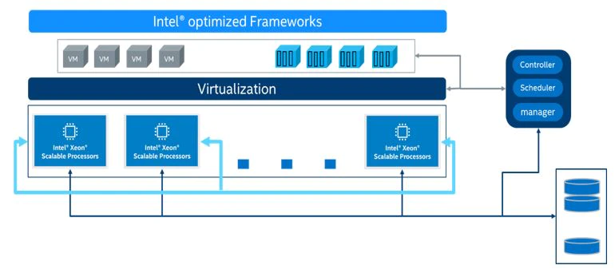

### AI Optimization Topics

The complete guide is available to download in PDF format.  This version offers more flexibility.  To get started, read these sections in the order listed below.  As you continue to optimize performance, use these as quick reference guides.

## Introducing Intel® AVX-512 and Intel® Deep Learning Boost

Intel&reg; Advanced Vector Extensions 512 (Intel&reg; AVX-512) is a &ldquo;single instruction, multiple data&rdquo; (SIMD) instruction set based on x86 processors that allows executing multiple data operations with a single instruction. As the name implies, Intel&reg; AVX-512 has a register width of 512 bits, and it supports 16 32-bit single-precision floating-point numbers or 64 8-bit integers.

Intel&reg; Xeon&reg; Scalable Processors support multiple types of workloads, including complex AI workloads.  They improve AI computation performance with the use of Intel&reg; Deep Learning Boost (Intel&reg; DL Boost). Intel Deep Learning Boost includes Intel&reg; AVX-512 VNNI (Vector Neural Network Instructions), AVX512 BF16 and AMX (Advanced Matrix Extension).

AVX-512 VNNI can combine three instructions (vpmaddubsw, vpmaddwd, and vpaddd) into one (vpdpbusd) execution.  This further unleashes the computing potential of next-generation Intel&reg; Xeon&reg; Scalable Processors and increases the inference performance of the INT8 model. 2nd Generation, 3rd Generation, and 4th Generation Intel&reg; Xeon&reg; Scalable Processors all support VNNI.

The AVX-512_BF16 feature includes an instruction (VDPBF16PS) to compute dot product of BF16 pairs and to accumulate to single precision (FP32), as well as instructions (VCVTNE2PS2BF16, VCVTNEPS2BF16) to convert packed single precision data (FP32) to packed BF16 data.

Intel® Advanced Matrix Extensions (Intel® AMX) is a new 64-bit programming paradigm consisting of two components: a set of 2-dimensional registers (tiles) representing sub-arrays from a larger 2-dimensional memory image and an accelerator able to operate on tiles.  The first implementation is called TMUL (tile matrix multiply unit).

### Intel&reg; Deep Learning Boost

| Processor | AVX-512 VNNI | AVX-512 BF16 | AMX|
|------------------|-------------|-------------|-------------|
| Cascade Lake     | V           |             |             | 
| Cooper Lake      | V           |V            |             | 
| Ice Lake         | V           |             |             | 
| Sapphire Rapids  | V           |V            | V           | 

#### AVX-512 VNNI

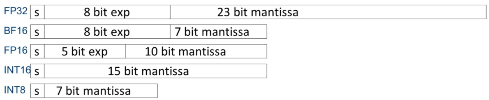

Platforms not using VNNI require the&nbsp;<strong>vpmaddubsw, vpmaddwd&nbsp;</strong>and<strong>&nbsp;vpaddd</strong>&nbsp;instructions to complete the multiply-accumulate operations in INT8 convolution operation:

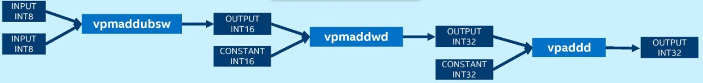

Platforms using VNNI require only one instruction, &ldquo;vpdpbusd&rdquo;, to complete the INT8 convolution operation:

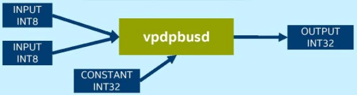

#### AMX

AMX introduces a new matrix register file with eight rank-2 tensor registers called “tiles”.  It also introduces the concept of accelerators that are capable of operating on those tiles. The matrix register file comprises eight tiles (named TMM0…TMM7), each having a maximum size of 16 rows by 64-byte columns for a total size of 1 KiB/register and 8 KiB for the entire register file.  Load a tile representing a small section from a larger image in memory, operate on that tile, and repeat with the next tile that represents the next portion of the image.  When done, store the resultant tile to memory.  The Tile Matrix Multiply (TMUL) unit comprises a grid of fused multiply-add units capable of operating on tiles.

  

##### AMX sub-extensions and related instructions

The AMX extension comprises three sub-extensions: AMX-TILE, AMX-INT8, and AMX-BF16.
| Instruction | AMX-TILE | AMX-INT8 | AMX-BF16|
|-------------|----------|----------|---------|
| LDTILECFG   | V        |          |         | 
| STTILECFG   | V        |          |         | 
| TILELOADD   | V        |          |         | 
| TILELOADDT1 | V        |          |         | 
| TILESTORED  | V        |          |         | 
| TILERELEASE | V        |          |         | 
| TILEZERO    | V        |          |         | 
| TDPBSSD     |          |V         |         | 
| TDPBSUD     |          |V         |         | 
| TDPBUSD     |          |V         |         | 
| TDPBUUD     |          |V         |         | 
| TDPBF16PS   |          |          | V       | 


## Environment

Tested hardware and software for this tuning guide includes:

### Hardware

The configuration described in this article is based on 4th Generation Intel® Xeon® processor hardware (codenamed Saphire Rapids). The server platform, memory, hard drives, and network interface cards can be determined according to your usage requirements.

| Hardware | Model |
|----------------------------------|------------------------------------|
| Server Platform Name/Brand/Model | Intel® Eagle Stream Server Platform |
| CPU | Intel® Xeon® PLATINUM 8479 CPU @ 2.00GHz | 
| Memory | 8*32 GB DDR5, 4800 MT/s | 

### Software

| Software | Version |
|------------------|-------------|
| Operating System | Ubuntu 22.04.1 LTS | 
| Kernel | 5.17.6 |
| Frequency Driver | intel_pstate |
| Frequency Governor | performance |

Note: The configuration described in this article is based on 4th Generation Intel Xeon processor hardware. Server platform, memory, hard drives, network interface cards can be determined according to customer usage requirements.  

### BIOS Settings

|Configuration item|Recommended value|
|------------------|-----------------|
| <b>Socket Configuration → Processor Configuration||
| &emsp; (New BIOS) Enable LP | single thread |
| &emsp; (Old BIOS) Hyper-Threading [ALL] | disable |
| <b>Socket Configuration → Advanced Power Management Configuration||
| &emsp; CPU P State Control | Set following items to 'Disable': <br> SpeedStep (Pstates), Energy Efficient Turbo, CPU Flex Ratio Override, Perf P-Limit |
| &emsp; CPU C State Control | Set following items to 'Disable': <br> CPU C1 auto demotion, CPU C1 auto undemotion, CPU C6 report, Enhanced Halt State (C1E) |
| &emsp; Package C State Control → Package C State | C0/C1 state |
| <b>Socket Configuration → Advanced Power Management Configuration → Advanced PM Tuning → Energy Perf BIAS||
| &emsp; Power Performance Tuning | OS Controls EPB |

### Memory

Use all available memory channels

### CPU

The 4th Generation of Intel&reg; Xeon&reg; Scalable processor comes with the all new Intel&reg; AMX (Advanced Matrix Extensions) instruction set. Intel&reg; AMX provides acceleration for mixed precision deep learning training and inference workloads. The 4th Generation of Intel&reg; Xeon&reg; Scalable processor provides two instruction sets viz. AMX_BF16 and AMX_INT8 which provides acceleration for bfloat16 and int8 operations respectively

Note:  To confirm that AMX_BF16 and AMX_INT8 are supported by the CPU, enter the following command on the bash terminal and look for AMX in the "flags" section. In case AMX instructions are not getting listed, consider updating the Linux kernel to 5.17 and above

```
$ cat /proc/cpuinfo
```

### Network

If cross-node training clusters are required, choose high-speed networks, such as 25G/100G, for better scalability.

### Hard drive

For high I/O efficiency, use SSDs and drives with higher read and write speeds.

## Linux Operating System Optimization

To speed up processing tune the Linux operating system for parallel programming.

### OpenMP Parameter Settings

The [OpenMP](https://www.openmp.org/) is a specification for parallel programming.  In case your application implements OpenMP based threading, experiment with the following environment variables and find the best fit values:

- OMP_NUM_THREADS = &ldquo;number of cpu cores in container&rdquo;
- KMP_BLOCKTIME = 1 or 0 (set according to actual type of model)
- KMP_AFFINITY=granularity=fine, verbose, compact,1,0

### Number of CPU cores

Consider the impact on inference performance based on the number of CPU cores being used, as follows:

&bull; When batchsize is small (in online services for instance) the increase in inference throughput gradually weakens as the number of CPU cores increases.  In practice, 8-16 CPU cores is recommended for service deployment depending on the model used.

&bull; When batchsize is large (in offline services for instance) the inference throughput can increase linearly as the number of CPU cores increases.  In practice, more than 20 CPU cores is recommended for service deployment.

``` # taskset -C xxx-xxx –p pid (limits the number of CPU cores used in service) ```

### NUMA Configuration

For NUMA-based servers, there is usually a 5-10% increase in performance when configuring NUMA on the same node compared to using it on different nodes.

``` #numactl -N NUMA_NODE -l command args ... (controls NUMA nodes running in service) ```

### Configuration of Linux Performance Governor

Efficiency is the key consideration.  Set the CPU frequency to its peak for the best performance.

``` # cpupower frequency-set -g performance ```

### CPU C-States Settings

There are several power modes available for each CPU which are collectively referred to as C-states or C-modes.  To reduce power consumption when the CPU is idle, the CPU can be placed in the low-power mode.  Disabling C-States can increase performance.

``` #cpupower idle-set -d 2,3 ```
 
## Using Intel® Extension for TensorFlow* for optimization and Performance boost

Intel® Extension for TensorFlow* adds optimizations for extra performance when running TensorFlow on Intel hardware. The intention of the extension is to deliver up-to-date features and optimizations for TensorFlow on Intel hardware. Examples include AVX-512 Vector Neural Network Instructions (AVX512 VNNI) and Intel® Advanced Matrix Extensions (Intel® AMX).

Intel® Extension for TensorFlow* has been released as an open–source project at https://github.com/intel/intel-extension-for-tensorflow

## Install TensorFlow* and Intel® Extension for TensorFlow*

Refer to [Installation Guide](https://intel.github.io/intel-extension-for-tensorflow/latest/docs/install/experimental/install_for_cpu.html) to install TensorFlow* and Intel® Extension for TensorFlow* for CPU.   
After having installed Intel® Extension for TensorFlow*, it will be activated automatically as a plugin of stock TensorFlow.

## Optimization Recommendations for Training and Inferencing TensorFlow-based Deep Learning Models
Intel® Extension for TensorFlow* is a Python package to extend official TensorFlow, achieve higher performance. Although stock TensorFlow and the default configuration of Intel® Extension for TensorFlow* perform well, there are still something that users can do for performance optimization on specific platforms. Most optimized configurations can be automatically set by the launch script. Mainly for the following:

- NUMA Control: numactl specifies NUMA scheduling and memory placement policy
- Number of instances: [Single instance (default) | Multiple instances]
- Memory allocator: [TCMalloc | JeMalloc | default Malloc] If unspecified, launch script will choose for user.  
- Runtime environment settings: OMP_NUM_THREADS, KMP_AFFINITY, KMP_BLOCKTIME, TF_NUM_INTEROP_THREADS, TF_NUM_INTRAOP_THREADS, ITEX_AUTO_MIXED_PRECISION, ITEX_LAYOUT_OPT, etc.

Refer to [Launch Script Usage Guide](https://intel.github.io/intel-extension-for-tensorflow/latest/docs/guide/launch.html) for more details.

Refer to [Practice Guide](https://intel.github.io/intel-extension-for-tensorflow/latest/docs/guide/practice_guide.html) for better understanding of common optimization tips which are used in launch script. 

## Enabling BFLOAT16
Intel® 4th Generation Intel® Xeon® Scalable Processors support accelerating AI inference by using low precision data types such as BFloat16 and INT8 based on the Intel® Deep Learning Boost and Intel® Advanced Matrix Extension(AMX). There are several instructions such as AMX_BF16, AMX_INT8, AVX512_BF16, AVX512_VNNI to accelerate AI models.

Mixed Precision uses lower-precision data types (such as FP16 or BF16) to make models run faster and with less memory consumption during training and inference.

Stock Tensorflow provides two ways to do this, Grappler Graph Optimization [Auto Mixed Precision](https://www.tensorflow.org/guide/graph_optimization)(AMP) and [Keras mixed precision API](https://www.tensorflow.org/guide/mixed_precision).

Intel® Extension for TensorFlow* is fully compatible with both of above methods in Stock TensorFlow, and provides an Advanced Auto Mixed Precision feature which is enhanced from Auto Mixed Precision of Stock TensorFlow for better performance.

**Intel® Extension for TensorFlow\* will turn off Auto Mixed Precision of Stock TensorFlow if its own Advanced Auto Mixed Precision is enabled explicitly.**

Refer to [Advanced Auto Mixed Precision](https://intel.github.io/intel-extension-for-tensorflow/latest/docs/guide/advanced_auto_mixed_precision.html) for more details.

#### Enable Advanced AMP

There are 2 ways to enable Advanced AMP in Intel® Extension for TensorFlow*: Python API and Environment Variables, choose either one which works for you.

|Python API|Environment Variables|
|-|-|
|`import intel_extension_for_tensorflow as itex`<br><br>`auto_mixed_precision_options = itex.AutoMixedPrecosionOptions()`<br>`auto_mixed_precision_options.data_type = itex.BFLOAT16`<br><br>`graph_options = itex.GraphOptions(auto_mixed_precision_options=auto_mixed_precision_options)`<br>`graph_options.auto_mixed_precision = itex.ON`<br><br>`config = itex.ConfigProto(graph_options=graph_options)`<br>`itex.set_backend("cpu", config)`|`export ITEX_AUTO_MIXED_PRECISION=1`<br>`export ITEX_AUTO_MIXED_PRECISION_DATA_TYPE="BFLOAT16"`<br>|

### For Inference

For a pre-trained FP32 model (resnet50 from TensorFlow Hub as an example below):

1. Install tensorflow_hub for this sample in addition to TensorFlow* and Intel® Extension for TensorFlow*
   ```
   pip install tensorflow_hub
   ```
2. Enable Advanced AMP (using environment variables as an example here)
   ```
   export ITEX_AUTO_MIXED_PRECISION=1  
   export ITEX_AUTO_MIXED_PRECISION_DATA_TYPE="BFLOAT16"
   ```
3. Run inference with ```export ONEDNN_VERBOSE=1```, you should be able to see AVX512_BF16 and AMX_BF16 instructions are enabled.

   - Save below code as itex_sample_inf.py
   
     ```
     import os
     import tensorflow as tf
     import tensorflow_hub as tf_hub

     os.environ["TFHUB_CACHE_DIR"] = 'tfhub_models'
     model = tf_hub.KerasLayer('https://tfhub.dev/google/imagenet/resnet_v1_50/classification/5')
     model(tf.random.uniform((1, 224, 224, 3)))
     ```
     
   - Run inference script in terminal
   
     ```
     export ONEDNN_VERBOSE=1
     python itex_sample_inf.py
     ```
     
   - Check the result
   
     ```
     onednn_verbose,exec,cpu,convolution,jit:avx512_core_amx_bf16,forward_training,src_bf16::blocked:acdb:f0 wei_bf16::blocked:Adcb16a:f0 bia_undef::undef::f0 dst_bf16::blocked:acdb:f0,attr-scratchpad:user ,alg:convolution_direct,mb1_ic3oc64_ih224oh112kh7sh2dh0ph3_iw224ow112kw7sw2dw0pw3,2.16406
     onednn_verbose,exec,cpu,reorder,jit:uni,undef,src_bf16::blocked:abcd:f0 dst_f32::blocked:abcd:f0,,,1x112x112x64,0.875
     onednn_verbose,exec,cpu,batch_normalization,bnorm_jit:avx512_core,forward_training,data_f32::blocked:acdb:f0 diff_undef::undef::f0,attr-scratchpad:user ,flags:GCHR,mb1ic64ih112iw112,0.754883
     onednn_verbose,exec,cpu,reorder,jit:uni,undef,src_f32::blocked:abcd:f0 dst_bf16::blocked:abcd:f0,,,1x112x112x64,0.178955
     onednn_verbose,exec,cpu,pooling_v2,jit:avx512_core_bf16,forward_inference,src_bf16::blocked:acdb:f0 dst_bf16::blocked:acdb:f0 ws_undef::undef::f0,attr-scratchpad:user ,alg:pooling_max,mb1ic64_ih112oh56kh3sh2dh0ph0_iw112ow56kw3sw2dw0pw0,0.283203
     onednn_verbose,exec,cpu,reorder,jit:uni,undef,src_bf16::blocked:cdba:f0 dst_bf16::blocked:AcdB16b64a2b:f0,,,256x64x1x1,1.02393
     onednn_verbose,exec,cpu,convolution,brgconv_1x1:avx512_core_amx_bf16,forward_training,src_bf16::blocked:acdb:f0 wei_bf16::blocked:AcdB16b64a2b:f0 bia_undef::undef::f0 dst_bf16::blocked:acdb:f0,attr-scratchpad:user ,alg:convolution_direct,mb1_ic64oc256_ih56oh56kh1sh1dh0ph0_iw56ow56kw1sw1dw0pw0,0.87207
     ```

### For Training

Same as inference, you can enable Advanced AMP either using Python API or setting environment variables for training. 

1. Enable Advanced AMP (using environment variables as an example here)
   ```
   export ITEX_AUTO_MIXED_PRECISION=1  
   export ITEX_AUTO_MIXED_PRECISION_DATA_TYPE="BFLOAT16"
   ```
2. Run training with ```export ONEDNN_VERBOSE=1```, you should be able to see AVX512_BF16 and AMX_BF16 instructions are enabled.

   - Save below code as itex_sample_train.py

     ```
     import tensorflow as tf
     from keras.utils import np_utils

     # load data
     cifar10 = tf.keras.datasets.cifar10
     (x_train, y_train), (x_test, y_test) = cifar10.load_data()
     num_classes = 10

     # pre-process
     x_train, x_test = x_train/255.0, x_test/255.0
     y_train = np_utils.to_categorical(y_train, num_classes)
     y_test = np_utils.to_categorical(y_test, num_classes)

     # build model
     feature_extractor_layer = tf.keras.applications.ResNet50(include_top=False, weights='imagenet')
     feature_extractor_layer.trainable = False
     model = tf.keras.Sequential([
         tf.keras.layers.Input(shape=(32, 32, 3)),
         feature_extractor_layer,
         tf.keras.layers.Flatten(),
         tf.keras.layers.Dense(1024, activation='relu'),
         tf.keras.layers.Dropout(0.2),
         tf.keras.layers.Dense(num_classes, activation='softmax')
     ])
     model.compile(
       optimizer=tf.keras.optimizers.Adam(),
       loss=tf.keras.losses.CategoricalCrossentropy(),
       metrics=['acc'])

     # train model
     model.fit(x_train, y_train,
         batch_size = 128,
         validation_data=(x_test, y_test), 
         epochs=1)

     model.save('resnet_bf16_model')
     ```
     
   - Run training script in terminal
   
     ```
     export ONEDNN_VERBOSE=1
     python itex_sample_train.py
     ```
     
   - Check the result

     ```
     onednn_verbose,exec,cpu,convolution,jit:avx512_core_amx_bf16,forward_training,src_bf16::blocked:acdb:f0 wei_bf16::blocked:Adcb16a:f0 bia_bf16::blocked:a:f0 dst_bf16::blocked:acdb:f0,attr-scratchpad:user ,alg:convolution_direct,mb128_ic3oc64_ih32oh16kh7sh2dh0ph3_iw32ow16kw7sw2dw0pw3,1.802
     onednn_verbose,exec,cpu,reorder,jit:uni,undef,src_bf16::blocked:abcd:f0 dst_f32::blocked:abcd:f0,,,128x16x16x64,6.74292
     onednn_verbose,exec,cpu,batch_normalization,bnorm_jit:avx512_core,forward_training,data_f32::blocked:acdb:f0 diff_undef::undef::f0,attr-scratchpad:user ,flags:GCHR,mb128ic64ih16iw16,2.65112
     onednn_verbose,exec,cpu,reorder,jit:uni,undef,src_f32::blocked:abcd:f0 dst_bf16::blocked:abcd:f0,,,128x16x16x64,0.845947
     onednn_verbose,exec,cpu,pooling_v2,jit:avx512_core_bf16,forward_inference,src_bf16::blocked:acdb:f0 dst_bf16::blocked:acdb:f0 ws_undef::undef::f0,attr-scratchpad:user ,alg:pooling_max,mb128ic64_ih18oh8kh3sh2dh0ph0_iw18ow8kw3sw2dw0pw0,0.195068
     onednn_verbose,exec,cpu,reorder,jit:uni,undef,src_bf16::blocked:cdba:f0 dst_bf16::blocked:AcdB16b64a2b:f0,,,64x64x1x1,1.72998
     onednn_verbose,exec,cpu,convolution,brgconv_1x1:avx512_core_amx_bf16,forward_training,src_bf16::blocked:acdb:f0 wei_bf16::blocked:AcdB16b64a2b:f0 bia_bf16::blocked:a:f0 dst_bf16::blocked:acdb:f0,attr-scratchpad:user ,alg:convolution_direct,mb128_ic64oc64_ih8oh8kh1sh1dh0ph0_iw8ow8kw1sw1dw0pw0,5.64795
     ```

## Enabling INT8

Intel® Extension for TensorFlow* co-works with [Intel® Neural Compressor](https://intel.github.io/neural-compressor) >= 1.14.1 to provide compatible TensorFlow INT8 quantization solution support with same user experience.

## Using Intel® Extension for Pytorch* for optimization and Performance boost

Intel® Extension for PyTorch* adds optimizations for extra performance when running PyTorch on Intel hardware.  Most of the optimizations will be included in stock PyTorch releases eventually.  The intention of the extension is to deliver up-to-date features and optimizations for PyTorch on Intel hardware.  Examples include AVX-512 Vector Neural Network Instructions (AVX512 VNNI) and Intel® Advanced Matrix Extensions (Intel® AMX).

Intel® Extension for PyTorch* has been released as an open–source project at [https://github.com/intel/intel-extension-for-pytorch](https://github.com/intel/intel-extension-for-pytorch)

## Using PyTorch*, a Deep Learning Framework

Make sure PyTorch is installed so that the extension will work properly. For more information on installation refer to: [https://intel.github.io/intel-extension-for-pytorch/latest/tutorials/installation.html#](https://intel.github.io/intel-extension-for-pytorch/latest/tutorials/installation.html#)

### Deploying PyTorch

Reference: [https://intel.github.io/intel-extension-for-pytorch/latest/index.html](https://intel.github.io/intel-extension-for-pytorch/latest/index.html)

Environment: Python 3.7 or above

Step 1: Visit the official PyTorch website: [https://pytorch.org/](https://pytorch.org/)

Step 2: Select CPU

Currently, Intel oneDNN is integrated into the official version of PyTorch, so there is no need for an additional installation to have accelerated performance on the Intel&reg; Xeon&reg; Scalable Processor platform. Select &ldquo;CPU&rdquo; for Compute Platform. See the figure below for details.


Step 3: Installation

``` 
pip3 install torch torchvision torchaudio --extra-index-url https://download.pytorch.org/whl/cpu

```

### Intel® Extension for PyTorch* Installation


You can use either of the following commands to install Intel® Extension for PyTorch*:

```
python -m pip install intel_extension_for_pytorch
```

```
python -m pip install intel_extension_for_pytorch -f https://software.intel.com/ipex-whl-stable
```

## Getting Started

Minor code changes are required for users to get started with Intel® Extension for PyTorch*. Both PyTorch imperative mode and TorchScript mode are supported. 

` For inference ` applies the ipex.optimize function to the model object. 

` For training ` applies the ipex.optimize function to the model object, as well as an optimizer object.

The following code snippet shows training code with BF16/FP32 data types.  More examples for training and inference are available at [Example Page](https://intel.github.io/intel-extension-for-pytorch/latest/tutorials/examples.html)

```
import torch
import intel_extension_for_pytorch as ipex

model = Model()
model = model.to(memory_format=torch.channels_last)
criterion = ...
optimizer = ...
model.train()

# For Float32
model, optimizer = ipex.optimize(model, optimizer=optimizer)

# For BFloat16
model, optimizer = ipex.optimize(model, optimizer=optimizer, dtype=torch.bfloat16)

# Setting memory_format to torch.channels_last could improve performance with 4D input data. This is optional.
data = data.to(memory_format=torch.channels_last)
optimizer.zero_grad()
output = model(data)
```

### Optimization Recommendations for Training and Inferencing PyTorch-based Deep Learning Models

Although default primitives of PyTorch and Intel® Extension for PyTorch* are highly optimized, there are additional configuration options that can improve performance. Most can be applied by a launch script that automates setting configuration options, mainly for the following:

1. OpenMP library: [Intel OpenMP library (default) | GNU OpenMP library]
2. Memory allocator: [PyTorch default memory allocator | Jemalloc | TCMalloc (default)]
3. Number of instances: [Single instance (default) | Multiple instances]

For more details refer to [Launch Script Usage Guide](https://intel.github.io/intel-extension-for-pytorch/latest/tutorials/performance_tuning/launch_script.html)

Apart from launch scripts there are other hardware settings that include configuring the structure of Intel CPUs, as well as Non-Uniform Memory Access (NUMA).  Software configuration can be set to take advantage of Channels Last memory format, OpenMP, numactl to fully utilize CPU computation resources with Intel® Extension for PyTorch* to boost performance.  For more details refer to [Performance Tuning Guide](https://intel.github.io/intel-extension-for-pytorch/latest/tutorials/performance_tuning.html)

### Enabling BFLOAT16 Inference 

Intel® 4th Generation Intel® Xeon® Scalable Processors support accelerating AI inference by using low precision data types such as BFloat16 and INT8 based on the Intel® Deep Learning Boost and Intel® Advanced Matrix Extension(AMX). There are several instructions such as AMX_BF16, AMX_INT8, AVX512_BF16, AVX512_VNNI to accelerate AI models.

#### Auto Mixed Precision(AMP)

` torch.cpu.amp ` provides convenience for auto data type conversion at runtime. Deep learning workloads can benefit from lower-precision floating point data types such as torch.float16 or torch.bfloat16, because of its lighter calculation workload and smaller memory usage. The Auto Mixed Precision (AMP) feature automates the tuning of data type conversions over all operators.

#### Steps to enable AMX_BF16

To check whether given cpu machine supports AMX_BF16 instructions, use ` lscpu ` command.

` torch.cpu.amp.autocast ` allows scopes of your script to run with mixed precision. In these scopes, operations run in a data type chosen by the autocast class to improve performance while maintaining accuracy.  The following simple network should show a speedup with mixed precision:

```
class SimpleNet(torch.nn.Module):
    def __init__(self):
        super(SimpleNet, self).__init__()
        self.conv = torch.nn.Conv2d(64, 128, (3, 3), stride=(2, 2), padding=(1, 1), bias=False)

    def forward(self, x):
        return self.conv(x)
        
```

` torch.cpu.amp.autocast ` is designed to be a context manager that allow the scope of your script to run with mixed precision. AMX_BF16 are newer and have more advanced intrinsics than AVX512_BF16. They offer better performance to support AI applications. Therefore, for the data type BFloat16, AMX_BF16 has the highest execution priority. The AI frameworks optimized by Intel will choose AMX_BF16 first. If it is not available, then AVX512_BF16 will be chosen.
For more details refer to [Auto Mixed Precision (AMP)](https://intel.github.io/intel-extension-for-pytorch/latest/tutorials/features/amp.html?highlight=amp)

```

model = SimpleNet().eval()
x = torch.rand(64, 64, 224, 224)
with torch.cpu.amp.autocast():
    y = model(x)
    
```
To Check whether AMX_BF16 is enabled, check for ` avx512_core_amx_bf16 ` JIT Kernel usage. Review the setting ` ONEDNN_VERBOSE=1 `

The Github link to the Intel® Extension for PyTorch* is:
[Intel® Extension for PyTorch*](https://github.com/intel/intel-extension-for-pytorch)

## Using Intel® Neural Compressor for Low Precision Optimization

## AI Neural Network Model Low Precision Optimization

### Overview

Intel® 4th Generation Intel® Xeon® Scalable Processors support accelerating AI inference by using low precision data types such as BFloat16 and INT8 based on the Intel® Deep Learning Boost and Intel® Advanced Matrix Extension.

1. Quantization

Using the INT8 data type to optimize AI model is one type of quantization, the process of mapping continuous infinite values to a smaller set of discrete finite values.

2. Mixed Precision

Mixed Precision uses lower-precision data types such as BFloat16 to make models that run with 16-bit and 32-bit mixed floating-point types during training and inference.  This runs faster with less memory consumption.

### Instruction

Intel® 4th Generation Intel® Xeon® Scalable Processors support several instructions to accelerate AI models:

|Intrinsics|AVX512_VNNI|AVX512_BF16|AMX_INT8|AMX_BF16|
|-|-|-|-|-|
|Data type|INT8|BFloat16|INT8|BFloat16|
|Variable type|Vector|Vector|Matrix|Matrix|

AMX_INT8/AMX_BF16 are newer and more advanced intrinsics than AVX512_VNNI/AVX512_BF16.  They offer better performance to support AI applications.  AMX_INT8 has the highest execution priority.  The AI frameworks optimized by Intel will choose AMX_INT8 first.  If it is not available, then AVX512_VNNI will be chosen.

### Steps

1. Convert FP32 model to INT8/BFloat16 model.

   Run quantization or the mixed precision process to get the INT8/BFloat16 model.

2. Execute the INT8/BFloat16 model inference on Intel® 4th Generation Intel® Xeon® Scalable Processors by the AI frameworks optimized for Intel Architecture.

   The AI framework will call highest level instrinsics supported by them in CPU to gain better performance.

   For example: If AI framework calls AVX512_VNNI, instead of AMX_INT8, please check if the newer release supports AMX_INT8 and install right release.

### AI Neural Network Quantization Process

Computations in neural networks are mainly concentrated in the convolution layer and the fully connected layer. The computations on these two layers can be expressed as:  Y = X * Weights + Bias. Therefore, it is natural to focus on matrix multiplication to optimize performance. The way to begin neural network model quantization is by trading-off precision (limited) for performance improvement. By replacing 32-bit floating-point numbers with low-precision integers for matrix operations, it not only speeds up calculations, but also compresses the model, thus saving memory bandwidth.

There are three approaches to the quantization of neural network models:

- Post-Training Quantization (PTQ), which is supported by most AI frameworks. Quantize a trained FP32 model. It execute a calibration process (infer FP32 model with small dataset) and record the data range of every layer's input and output. Then quantize the model according to the data range info. It provides good quantizatin result.

- Quantization-Aware-Training (QAT), which inserts the FakeQuantization node into the FP32 model when the training converges. It increases the quantization-induced noise. During the backpropagation stage of the training, the model weights fall into a finite interval which results in better quantization precision.

- Dynamic Quantization (DQ) is very similar to PTQ. They are both quantization methods used on post-trained models. The difference lies in that the quantization factor in the activation layer is dynamically decided by the data range used when the neural network model is run, while for PTQ samples from a small-scale pre-processed dataset are used to obtain data distribution and range information in the activation layer, then records it permanently in the newly generated quantization model. Of the Intel® Intel® Neural Compressor which we will talk about later on,  onnxruntime supports this method at the backend only.

The basic procedure for the post-training quantization of neural network is as follows:

1. Fuse FP32 OP to INT8 OP. For example, <em>MatMul</em>, <em>BiasAdd</em> and <em>ReLU</em> can be fused into a single quantized OP at the fully connected layer,  <em>QuantizedMatMulWithBiasAndRelu</em>. Different neural network frameworks support different fuse-able OPs.
For Intel® Intel® Neural Compressor, which will be discussed later on, here is a list of fuse-able OPs supported by TensorFlow: [https://github.com/intel/neural-compressor/blob/master/neural_compressor/adaptor/tensorflow.yaml#L110](https://github.com/intel/neural-compressor/blob/master/neural_compressor/adaptor/tensorflow.yaml#L110).
For fuse-able OPs supported by pyTorch, please see : [https://github.com/intel/neural-compressor/blob/master/neural_compressor/adaptor/pytorch_cpu.yaml#L251](https://github.com/intel/neural-compressor/blob/master/neural_compressor/adaptor/pytorch_cpu.yaml#L251)

2. Quantize weights and save them in the quantized model.

3. Quantize the input/activation layer by sampling the calibration dataset to acquire the distribution and range information of the data in the activation layer, which is then recorded in the newly generated quantized model.

4. The Requantize operation is fused into its corresponding INT8 OP to generate the final quantized model.

Using a simple model which includes two layers of  MatMul as an example, we can observe the quantization process as follows:

<div  align="center">
  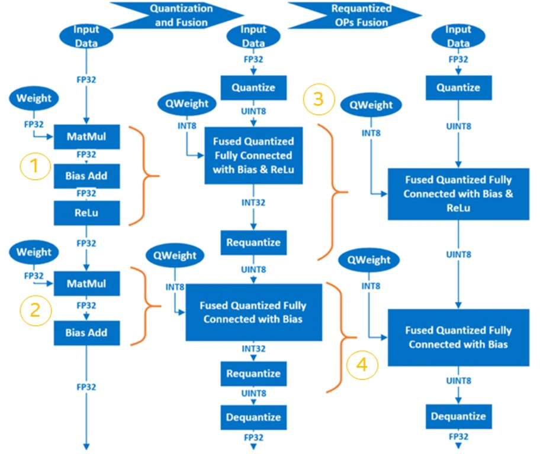
</div>

### AI Neural Network Mixed Precision Process

FP32 and BFloat16 have same data range and different decimal part. It's easy to convert FP32 to BFloat16. But use BFloat16 will impact the model accuracy due to the cutted decimal part.

Some operations are numerically-safe for Bfloat16, that means the operation based on Bfloat16 has no obviously accuracy loss compared to FP32;

Some operations are numerically-dangerous for Bfloat16, that means the operation based on Bfloat16 has obviously accuracy loss compared to FP32;

The precedure is as follows:

1. According to the experiment, set the numerically-safe operations to allow set and numerically-dangerous operations to deny set.

   It's allow user to tune it manually by configuration.

2. Convert the operations in allow set to BFloat16.

3. Insert the "Cast" operation between FP32 and BFloat16 operations to convert data from FP32 to BFloat16 or revert.

Above precedure will be handled by AI framework/tool automaticlly.

### Intel® Neural Compressor

[Intel® Neural Compressor](https://intel.github.io/neural-compressor) is one of the key AI software components in the Intel® oneAPI AI Analytics Toolkit.  It is an open-source Python library that runs on Intel CPUs and GPUs.  This toolkit delivers unified interfaces across multiple deep learning frameworks for popular network compression technologies, such as quantization, pruning, and knowledge distillation. It supports automatic, accuracy-driven, tuning strategies to quickly find the best model.  It also implements different weight pruning algorithms to generate a pruned model with a pre-defined sparsity goal and it supports knowledge distillation from a teacher model to a student model.

Reference: [https://github.com/intel/neural-compressor](https://github.com/intel/neural-compressor)

<div  align="center">
  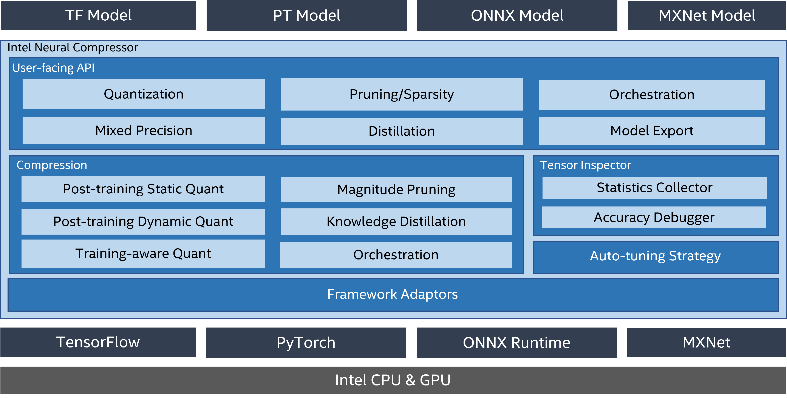
</div>


Intel® Neural Compressor currently support the following Intel optimized deep learning frameworks:

- [Tensorflow*](https://www.tensorflow.org/)
- [PyTorch*](https://pytorch.org/)
- [Apache* MXNet](https://mxnet.apache.org/)
- [ONNX Runtime](https://onnx.ai/)

The frameworks and their versions that have already been verified are shown below:

* OS version: CentOS 8.4, Ubuntu 20.04
* Python version: 3.7, 3.8, 3.9, 3.10

<table class="docutils">
<thead>
  <tr>
    <th>Framework</th>
    <th>TensorFlow</th>
    <th>Intel TensorFlow</th>
    <th>PyTorch</th>
    <th>IPEX</th>
    <th>ONNX Runtime</th>
    <th>MXNet</th>
  </tr>
</thead>
<tbody>
  <tr align="center">
    <th>Version</th>
    <td class="tg-7zrl"><a href=https://github.com/tensorflow/tensorflow/tree/v2.9.1>2.9.1</a><br>
    <a href=https://github.com/tensorflow/tensorflow/tree/v2.8.2>2.8.2</a><br>
    <a href=https://github.com/tensorflow/tensorflow/tree/v2.7.3>2.7.3</a><br>
    <td class="tg-7zrl"><a href=https://github.com/Intel-tensorflow/tensorflow/tree/v2.9.1>2.9.1</a><br>
    <a href=https://github.com/Intel-tensorflow/tensorflow/tree/v2.8.0>2.8.0</a><br>
    <a href=https://github.com/Intel-tensorflow/tensorflow/tree/v2.7.0>2.7.0</a><br>
    <td class="tg-7zrl"><a href=https://download.pytorch.org/whl/torch_stable.html>1.12.0+cpu</a><br>
    <a href=https://download.pytorch.org/whl/torch_stable.html>1.11.0+cpu</a><br>
    <a href=https://download.pytorch.org/whl/torch_stable.html>1.10.0+cpu</a></td>
    <td class="tg-7zrl"><a href=https://github.com/intel/intel-extension-for-pytorch/tree/v1.12.0>1.12.0</a><br>
    <a href=https://github.com/intel/intel-extension-for-pytorch/tree/v1.10.0>1.11.0</a><br>
    <a href=https://github.com/intel/intel-extension-for-pytorch/tree/v1.9.0>1.10.0</a></td>
    <td class="tg-7zrl"><a href=https://github.com/microsoft/onnxruntime/tree/v1.11.0>1.11.0</a><br>
    <a href=https://github.com/microsoft/onnxruntime/tree/v1.10.0>1.10.0</a><br>
    <a href=https://github.com/microsoft/onnxruntime/tree/v1.9.0>1.9.0</a></td>
    <td class="tg-7zrl"><a href=https://github.com/apache/incubator-mxnet/tree/1.8.0>1.8.0</a><br>
    <a href=https://github.com/apache/incubator-mxnet/tree/1.7.0>1.7.0</a><br>
    <a href=https://github.com/apache/incubator-mxnet/tree/1.6.0>1.6.0</a></td>
  </tr>
</tbody>
</table>

> **Note:**
> Please set the environment variable TF_ENABLE_ONEDNN_OPTS=1 to enable oneDNN optimizations if you are using TensorFlow from v2.6 to v2.8. oneDNN has been fully default from TensorFlow v2.9.

The tuning strategies supported by Intel® Neural Compressor include:

- [Basic](https://github.com/intel/neural-compressor/blob/master/docs/tuning_strategies.md#basic)
- [Bayesian](https://github.com/intel/neural-compressor/blob/master/docs/tuning_strategies.md#bayesian)
- [MSE](https://github.com/intel/neural-compressor/blob/master/docs/tuning_strategies.md#mse)
- [TPE](https://github.com/intel/neural-compressor/blob/master/docs/tuning_strategies.md#tpe)
- [Exhaustive](https://github.com/intel/neural-compressor/blob/master/docs/tuning_strategies.md#exhaustive)
- [Random](https://github.com/intel/neural-compressor/blob/master/docs/tuning_strategies.md#random)

The workflow for Intel® Neural Compressor is shown below. The model quantization parameters matching the accuracy loss target are automatically selected according to the set tuning strategy, and the quantized model is generated:

<div  align="center">
  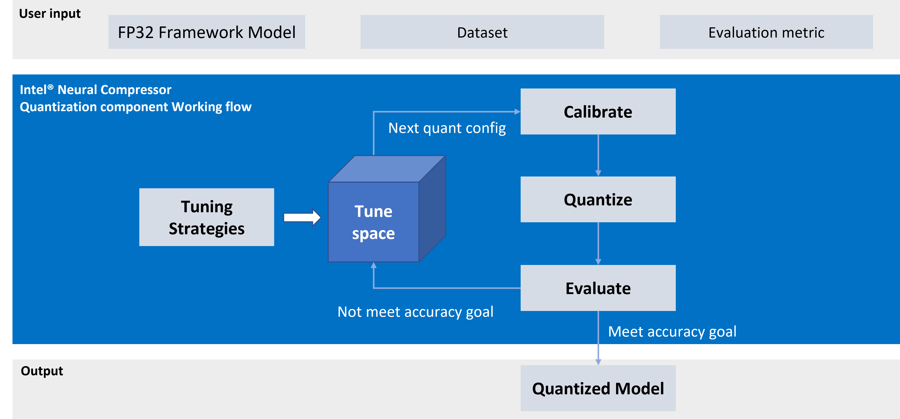
</div>


### Installing Intel® Neural Compressor

For details on installation, refer to: [https://github.com/intel/neural-compressor#installation](https://github.com/intel/neural-compressor#installation)

Step 1: Use  Anaconda to create a  Python3.x virtual environment with the name: env_inc. We are using Python 3.9 here as an example:

```
conda create -n env_inc python=3.9
conda activate env_inc
```

Step 2: Install Intel® Neural Compressor with the binary file:

```
# install stable basic version from pip
pip install neural-compressor
# install stable full version from pip (including GUI)
pip install neural-compressor-full
```
or
```
# install nightly basic version from pip
pip install -i https://test.pypi.org/simple/ neural-compressor
# install nightly full version from pip (including GUI)
pip install -i https://test.pypi.org/simple/ neural-compressor-full
```
or
```
# install stable basic version from from conda
conda install neural-compressor -c conda-forge -c intel
# install stable full version from from conda (including GUI)
conda install neural-compressor-full -c conda-forge -c intel
```

Step 3: Install AI Framework

Install Tensorflow, Pytorch, ONNX-RT, MXNet according to the model type to be handled.
For example, to install intel-tensorflow
```
# install intel-tensorflow from pip
pip install intel-tensorflow
```

### Using Intel® Neural Compressor

We are using  ResNet50 v1.0 as an example to explain how to use this tool for quantization and mixed precision optimization.

### Dataset preparation:

Step 1: Download and decompress the ImageNet validation dataset:

To download the raw images, the user must create an account with image-net.org.

```
mkdir –p img_raw/val
cd img_raw
wget http://www.image-net.org/challenges/LSVRC/2012/xxxxxxxx/ILSVRC2012_img_val.tar
tar –xvf ILSVRC2012_img_val.tar -C val
```

Step 2: Move the image files to the child directories sorted by label:


```
cd val
wget -qO- https://raw.githubusercontent.com/soumith/imagenetloader.torch/master/valprep.sh | bash
```

Step 3: Use the script, [prepare_dataset.sh](https://github.com/intel/neural-compressor/blob/master/examples/tensorflow/image_recognition/tensorflow_models/quantization/ptq/prepare_dataset.sh), to convert raw data to the TFrecord format with 128 shards:


```
git clone https://github.com/intel/neural-compressor.git
cd neural-compressor/
git checkout 6663f7b
cd examples/tensorflow/image_recognition/tensorflow_models/quantization/ptq
bash prepare_dataset.sh --output_dir=./data --raw_dir=/PATH/TO/img_raw/val/ --shards=128 --subset=validation
```
Reference: [https://github.com/intel/neural-compressor/tree/master/examples/tensorflow/image_recognition/tensorflow_models/quantization/ptq#2-prepare-dataset](https://github.com/intel/neural-compressor/tree/master/examples/tensorflow/image_recognition/tensorflow_models/quantization/ptq#2-prepare-dataset)

### Pretrained FP32 Model preparation:

```
wget https://storage.googleapis.com/intel-optimized-tensorflow/models/v1_6/resnet50_fp32_pretrained_model.pb
```
### Run Qunatization:

Edit the file: [examples/tensorflow/image_recognition/tensorflow_models/quantization/ptq/resnet50_v1.yaml](https://github.com/intel/neural-compressor/blob/master/examples/tensorflow/image_recognition/tensorflow_models/quantization/ptq/resnet50_v1.yaml), change all default dataset path (root: /path/to/evaluation/dataset) for quantization, evaluation to real local path to save the TFRecord format dataset generated previously during the data preparation stage.


```
cd examples/tensorflow/image_recognition/tensorflow_models/quantization/ptq
bash run_tuning.sh --config=resnet50_v1.yaml \
    --input_model=/PATH/TO/resnet50_fp32_pretrained_model.pb \
    --output_model=./nc_resnet50_v1.pb
```

Reference: [https://github.com/intel/neural-compressor/tree/master/examples/tensorflow/image_recognition/tensorflow_models/quantization/ptq#1-resnet50-v10](https://github.com/intel/neural-compressor/tree/master/examples/tensorflow/image_recognition/tensorflow_models/quantization/ptq#1-resnet50-v10)

### Run Mix Precision (BFloat16 + FP32):

Refer to [Mixed Precision](https://github.com/intel/neural-compressor/blob/master/docs/mixed_precision.md)

#### Convert Without Tuning Accuracy

This method is sample and convert more nodes to BFloat16 as possible. The accuracy of model would be lossed as unexpected.

```
python convert_bf16_without_tuning.py

from neural_compressor.experimental import MixedPrecision
converter = MixedPrecision()
converter.precisions = 'bf16'
converter.model = '/PATH/TO/resnet50_fp32_pretrained_model.pb'
optimized_model = converter()
optimized_model.save('nc_resnet50_v1_bf16.pb')
```
#### Convert With Tuning Accuracy

This method is accuracy driven and needs evaluation precedure. The accuracy of model would be lossed as expected, but less nodes are converted to BFloat16 compared with above method.

1. Edit resnet50_v1.yaml

Add

```
mixed_precision:
  precisions: 'bf16'
```

Like:
```
model:
  name: resnet50_v1
  framework: tensorflow

mixed_precision:
  precisions: 'bf16'

evaluation:
  accuracy:
    dataloader:
      ...
    metric:
      ...
```

2. Run Python
```
python convert_bf16_with_tuning.py

from neural_compressor.experimental import MixedPrecision
converter = MixedPrecision('resnet50_v1.yaml')
converter.precisions = 'bf16'
converter.model = '/PATH/TO/resnet50_fp32_pretrained_model.pb'
optimized_model = converter()
optimized_model.save('nc_resnet50_v1_bf16.pb')
```

### INT8 + BFloat16 + FP32

It's possible to mix INT8, BFloat16, FP32 in a model to optimize performance.

In this example, we could apply mixed precesion on the quantized model: nc_resnet50_v1.pb. So we could get INT8 + BFloat16 + FP32 model.


```
python convert_bf16_without_tuning.py

from neural_compressor.experimental import MixedPrecision
converter = MixedPrecision()
converter.precisions = 'bf16'
converter.model = '/PATH/TO/nc_resnet50_v1.pb'
optimized_model = converter()
optimized_model.save('nc_resnet50_v1_int8_bf16.pb')
```

In the log, we could see there is one operation: MatMul to be converted to BFloat16. That would improve the performance a little more.

If the quantized model has more operations are FP32, mixed precision could convert more to BFloat16 and gain better performance.

```
2022-08-04 19:50:01 [INFO] |**********Mixed Precision Statistics**********|
2022-08-04 19:50:01 [INFO] +-------------+--------+-------+-------+-------+
2022-08-04 19:50:01 [INFO] |   Op Type   | Total  |  INT8 |  BF16 |  FP32 |
2022-08-04 19:50:01 [INFO] +-------------+--------+-------+-------+-------+
2022-08-04 19:50:01 [INFO] |   MaxPool   |   1    |   1   |   0   |   0   |
2022-08-04 19:50:01 [INFO] |   AvgPool   |   1    |   1   |   0   |   0   |
2022-08-04 19:50:01 [INFO] |    Conv2D   |   53   |   53  |   0   |   0   |
2022-08-04 19:50:01 [INFO] |    MatMul   |   1    |   0   |   1   |   0   |
2022-08-04 19:50:01 [INFO] |  QuantizeV2 |   1    |   1   |   0   |   0   |
2022-08-04 19:50:01 [INFO] |  Dequantize |   1    |   1   |   0   |   0   |
2022-08-04 19:50:01 [INFO] |     Cast    |   2    |   0   |   1   |   1   |
2022-08-04 19:50:01 [INFO] +-------------+--------+-------+-------+-------+

```

### Run Benchmark:

For performance:

```
bash run_benchmark.sh --input_model=./xxx.pb --config=resnet50_v1.yaml --mode=performance
```
Performance mode benchmark result:

```
 Batch size = 1
 Latency: xxx
 Throughput: xxx
```

For accuracy:

```
bash run_benchmark.sh --input_model=./xxx.pb --config=resnet50_v1.yaml --mode=accuracy
```

Accuracy mode benchmark result:

```
 Accuracy is x.xx
 Batch size = 32
```

## Additional References

Intel® AVX-512 info: [https://colfaxresearch.com/skl-avx512/](https://colfaxresearch.com/skl-avx512/)

Intel® Optimized AI Frameworks: [https://www.intel.com/content/www/us/en/developer/tools/frameworks/overview.html](/content/www/us/en/developer/tools/frameworks/overview.html)

Intel® Neural Compressor: [https://github.com/intel/neural-compressor](https://github.com/intel/neural-compressor)
  
## Using Intel&reg; Distribution of OpenVINO&trade; Toolkit for Inference Acceleration

### Intel&reg; Distribution of OpenVINO&trade; Toolkit

OpenVINO™ is an open-source toolkit for optimizing and deploying AI inference with the following features:  
  
- Boost deep learning performance in computer vision, automatic speech recognition, natural language processing and other common tasks  
- Use models trained with popular frameworks like TensorFlow, PyTorch, and more  
- Reduce resource demands and efficiently deploy on a range of Intel® platforms from edge to cloud  

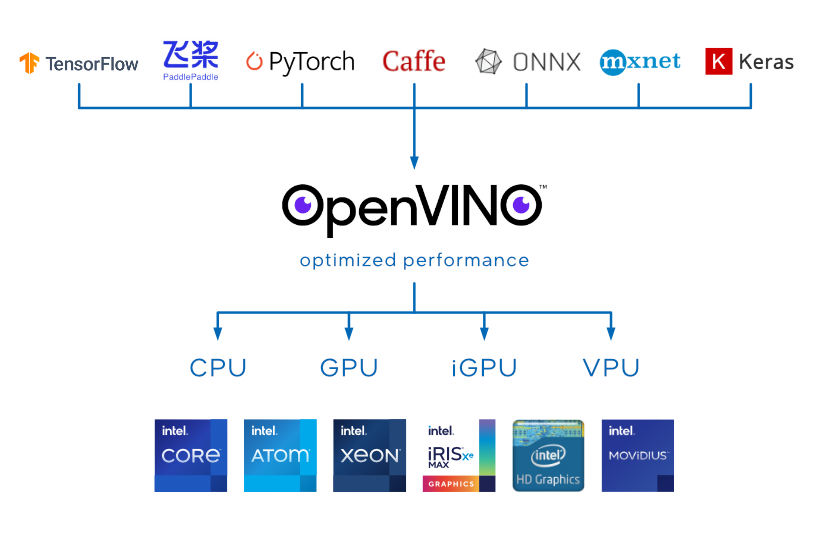  
  
The scheme below illustrates the typical workflow for deploying a deep learning model that has been trained using OpenVINO™:  

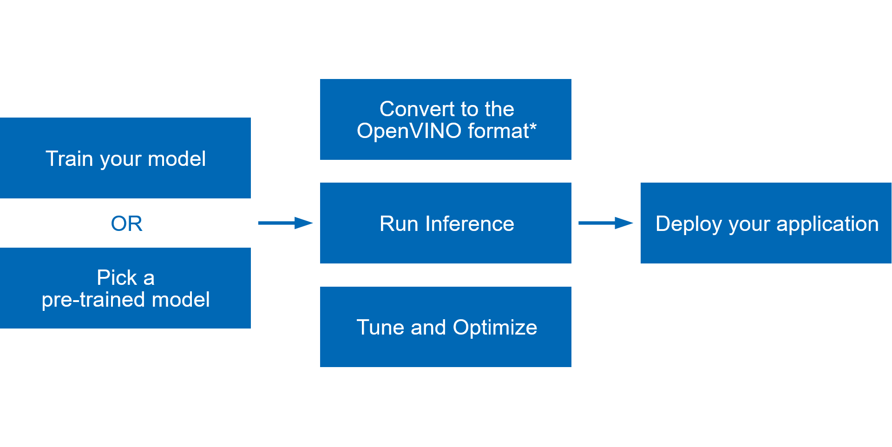

- Train your model with popular frameworks like TensorFlow* and PyTorch*, or pick a pre-trained model from open model zoo.  
- Run Model Optimizer to perform static model analysis and produce an optimized Intermediate Representation (IR) of the model that can be inferred with OpenVINO™ Runtime. 
- Use OpenVINO Runtime API to read an Intermediate Representation (IR), ONNX, or PaddlePaddle model and execute it on preferred devices.  
- Tune and optimize the whole pipeline to improve final model performance by applying special optimization methods like quantization, pruning, preprocessing optimization, etc.  
- Once everything is done, [deploy your application with OpenVINO™](https://docs.openvino.ai/latest/openvino_deployment_guide.html)  
  
For more information, refer to OpenVINO™ online documentation: <https://docs.openvino.ai/latest/index.html>

### Enable BFLOAT16/INT8 Inference with Intel® Deep Learning Boost

The default floating-point precision of a CPU primitive is f32. On platforms that natively support bfloat16 calculations with AVX512_BF16 or AMX_BF16 extensions, the bf16 type is automatically used instead of f32.  This will achieve better performance.  See the [BFLOAT16 – Hardware Numerics Definition white paper](https://www.intel.com/content/dam/develop/external/us/en/documents/bf16-hardware-numerics-definition-white-paper.pdf) for more details about the bfloat16 format.  

Using bf16 precision provides the following performance benefits:

- Faster multiplication of two bfloat16 numbers because of the shorter mantissa of the bfloat16 data.  
- Reduced memory consumption since bfloat16 data size is two times smaller than 32-bit float.  

To check whether a CPU device can support the bfloat16 data type, use the [openvino.runtime.Core.get_property](https://docs.openvino.ai/latest/api/ie_python_api/_autosummary/openvino.runtime.Core.html#openvino.runtime.Core.get_property) to query the [ov::device::capabilities](https://docs.openvino.ai/latest/groupov_runtime_cpp_prop_api.html#doxid-group-ov-runtime-cpp-prop-api-1gadb13d62787fc4485733329f044987294) property.  It should contain BF16 in the list of CPU capabilities as shown below:
  
    core = Core()
    cpu_optimization_capabilities = core.get_property("CPU", "OPTIMIZATION_CAPABILITIES")
   
Use the benchmark_app to check whether BF16/I8 is enabled when running inference:

- [Install OpenVINO™ Development Tools](https://docs.openvino.ai/latest/openvino_docs_install_guides_install_dev_tools.html) and [Install OpenVINO™ Runtime](https://docs.openvino.ai/latest/openvino_docs_install_guides_install_runtime.html)
- BFloat16
  - Download FP32 model from open model zoo (or pick your own FP32 model), download [horizontal-text-detection-0001](https://docs.openvino.ai/latest/omz_models_model_horizontal_text_detection_0001.html) here as an example:  
`omz_downloader --name horizontal-text-detection-0001 --precisions FP32 -o .`  
  - Run benchmark app with -pc  
`benchmark_app -m ./intel/horizontal-text-detection-0001/FP32/horizontal-text-detection-0001.xml -pc`  
  - We can see some kernels are running with BF16 precison with both avx512 and amx instructions.  
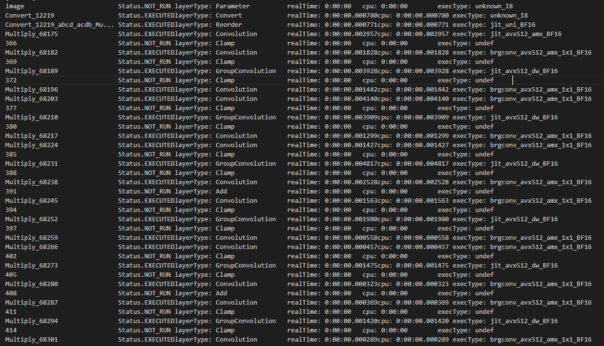
- INT8
  - Download INT8 model from open model zoo (or pick your own INT8 model), download [horizontal-text-detection-0001](https://docs.openvino.ai/latest/omz_models_model_horizontal_text_detection_0001.html) here as an example:  
`omz_downloader --name horizontal-text-detection-0001 --precisions FP16-INT8 -o .`  
  - Run benchmark app with -pc  
`benchmark_app -m ./intel/horizontal-text-detection-0001/FP16-INT8/horizontal-text-detection-0001.xml -pc`  
  - We can see some kernels are running with I8 precison with both avx512 and amx instructions.  
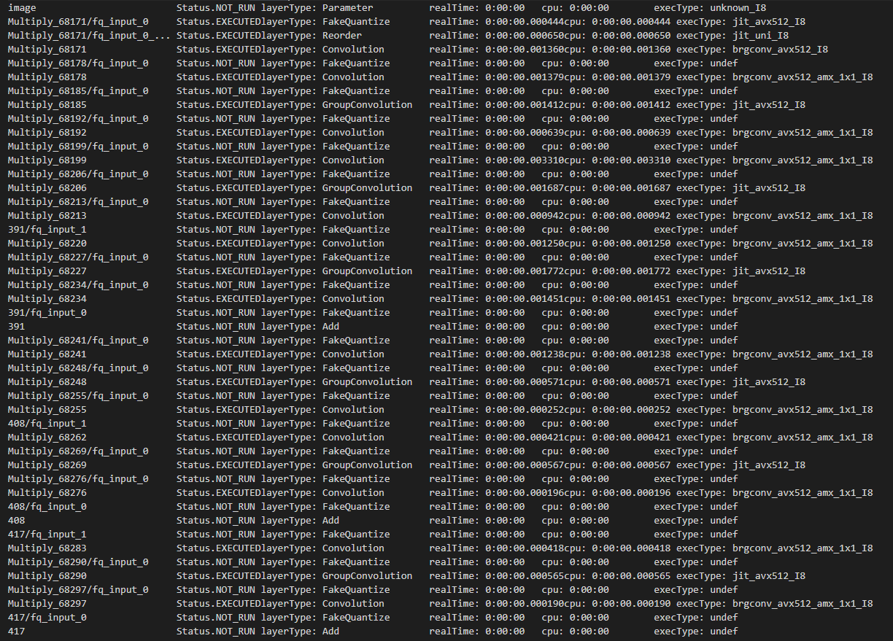

**Notes**  
  
Due to the reduced mantissa size of the bfloat16 data type, the resulting bf16 inference accuracy may differ from the f32 inference, especially for models that were not trained using the bfloat16 data type. If the bf16 inference accuracy is not acceptable, switch to the f32 precision.

C++:

	ov::Core core;
	core.set_property("CPU", ov::hint::inference_precision(ov::element::f32));

Python:

	core = Core()
	core.set_property("CPU", {"INFERENCE_PRECISION_HINT": "f32"})
	
If you use the benchmark_app, set -infer_precision to f32, for example:  

`benchmark_app -m ./intel/horizontal-text-detection-0001/FP32/horizontal-text-detection-0001.xml -pc -infer_precision f32`
  
## Data Analytics and Machine Learning Acceleration
  
As a branch of artificial intelligence, machine learning is currently attracting much attention. Machine learning-based analytics are also becoming increasingly popular.  When compared to other analytics, machine learning can help IT staff, data scientists, and business teams in many types of organizations to quickly unleash the power of AI. Furthermore, machine learning offers many new commercial and open-source solutions, providing a vast ecosystem for developers. Developers can choose from a variety of open-source machine learning libraries such as  Scikit-learn*,  Cloudera* and  Spark* MLlib.

### Intel&reg; Distribution for Python*

Intel&reg; Distribution for Python* is a Python development toolkit for artificial intelligence software developers. It can be used to accelerate the computational speed of Python on the Intel&reg; Xeon&reg; Scalable Processor platform. It is available with  Anaconda* and it can also be installed and used with Conda*, PIP*, APT GET, YUM, Docker*, and others. 

Intel&reg; Distribution for Python* features:

- Take advantage of the most popular and fastest growing programming language with underlying instruction sets optimized for Intel® architectures.
- Achieve near-native performance through acceleration of core Python numerical and scientific packages that are built using Intel® Performance Libraries.
- Achieve highly efficient multithreading, vectorization, and memory management, and scale scientific computations efficiently across a cluster.
- Core packages include Numba, NumPy, SciPy, and more.  

Reference and download site: [https://www.intel.com/content/www/us/en/developer/tools/oneapi/distribution-for-python.html](https://www.intel.com/content/www/us/en/developer/tools/oneapi/distribution-for-python.html)
  
### Intel® Distribution of Modin*
  
Modin* is a drop-in replacement for pandas, enabling data scientists to scale to distributed DataFrame processing without having to change API code. Intel® Distribution of Modin* adds optimizations to further accelerate processing on Intel® hardware.

Using this library, you can:

- Process terabytes of data on a single workstation
- Scale from a single workstation to the cloud using the same code
- Focus more on data analysis and less on learning new APIs  
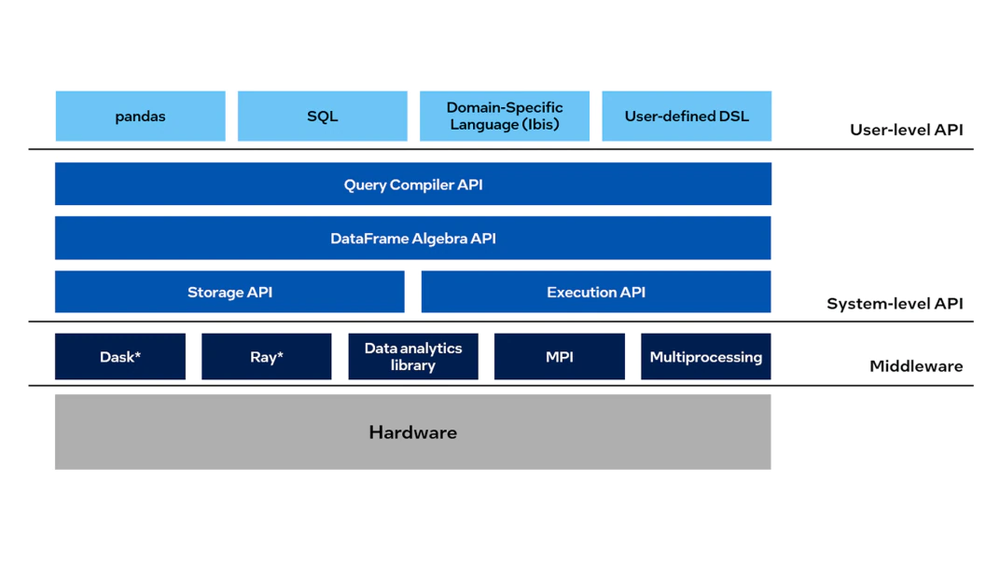

Intel® Distribution of Modin* Features:  

- Accelerated DataFrame Processing
  - Speed up the extract, transform, and load (ETL) process for large DataFrames
  - Automatically use all of the processing cores available on your machine 

- Optimized for Intel Hardware
  - Scale to terabytes of data using Intel® Optane™ Persistent Memory on a single data science workstation
  - Analyze large datasets (over one billion rows) using HEAVY.AI* analytics

- Compatible with Existing APIs and Engines
  - Change one line of code to use your existing pandas API calls, no matter the scale. Instead of importing pandas as pd, simply import modin.pandas as pd by using this command: `import modin.pandas as pd`
    ```
    # import pandas as pd
    import modin.pandas as pd  
    df = pd.read_csv("my_dataset.csv")
    ```
  - Use Dask*, Ray, or HEAVY.AI compute engines to distribute data without having to write code
  - Continue to use the rest of your Python ecosystem code, such as NumPy, XGBoost, and scikit-learn*
  - Use the same notebook to scale from your local machine to the cloud
   
Reference and download site: [https://www.intel.com/content/www/us/en/developer/tools/oneapi/distribution-of-modin.htm](https://www.intel.com/content/www/us/en/developer/tools/oneapi/distribution-of-modin.htm) 

### Intel® Extension for Scikit-learn*

Intel® Extension for Scikit-learn* can seamlessly speed up your scikit-learn applications for Intel® CPUs and GPUs across single and multi-node configurations. This extension package dynamically patches scikit-learn estimators while improving performance for your machine learning algorithms.

The top benefits are:

- No up-front cost for learning a new API
- Integration with the Python* ecosystem
- Up to 100x better performance and accuracy than the standard scikit-learn

[Learn More about Patching scikit-learn](https://intel.github.io/scikit-learn-intelex/what-is-patching.html)  

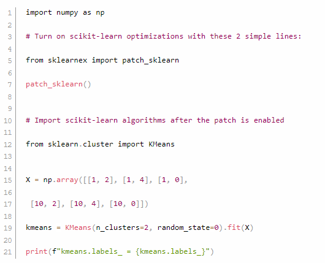

Reference and download site: [https://www.intel.com/content/www/us/en/developer/tools/oneapi/scikit-learn.html](https://www.intel.com/content/www/us/en/developer/tools/oneapi/scikit-learn.html)

### XGBoost* Optimized for Intel® Architecture

Starting with XGBoost* Version 0.81 and later, Intel® has been directly adding many optimizations to provide superior performance on Intel® CPUs. This well-known, machine-learning package for gradient-boosted decision trees now includes drop-in acceleration for Intel® architectures to significantly speed up model training and improve accuracy for better predictions.

Reference and download site: [https://www.intel.com/content/www/us/en/developer/articles/technical/xgboost-optimized-architecture-getting-started.html](https://www.intel.com/content/www/us/en/developer/articles/technical/xgboost-optimized-architecture-getting-started.html)

### Intel® oneAPI Data Analytics Library (oneDAL)

Intel® oneAPI Data Analytics Library (oneDAL) is a library that helps speed up big data analysis by providing highly optimized algorithmic building blocks for all stages of data analytics (preprocessing, transformation, analysis, modeling, validation, and decision making) in batch, online, and distributed processing modes.

The library optimizes data ingestion along with algorithmic computation to increase throughput and scalability. It includes C++ and Java* APIs and connectors to popular data sources such as Spark* and Hadoop*. Python* wrappers for oneDAL are part of Intel Distribution for Python.

In addition to classic features, oneDAL provides DPC++ SYCL API extensions to the traditional C++ interface and enables GPU usage for some algorithms.

The library is particularly useful for distributed computation. It provides a full set of building blocks for distributed algorithms that are independent from any communication layer. This allows users to construct fast and scalable distributed applications using user-preferable communication means.

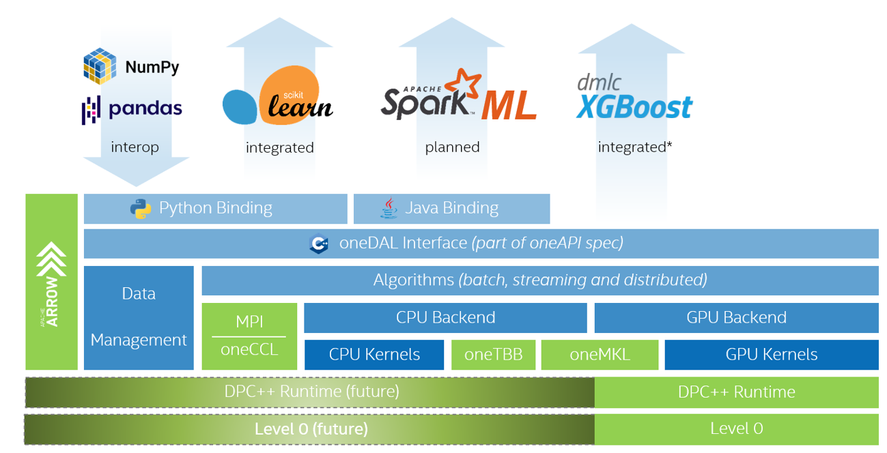

Reference and download site: [https://www.intel.com/content/www/us/en/developer/tools/oneapi/onedal.html](https://www.intel.com/content/www/us/en/developer/tools/oneapi/onedal.html)

  
