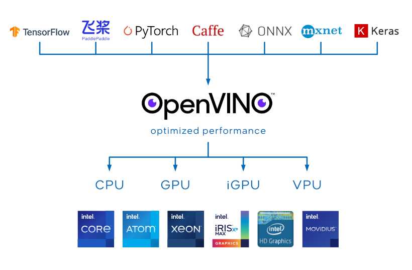
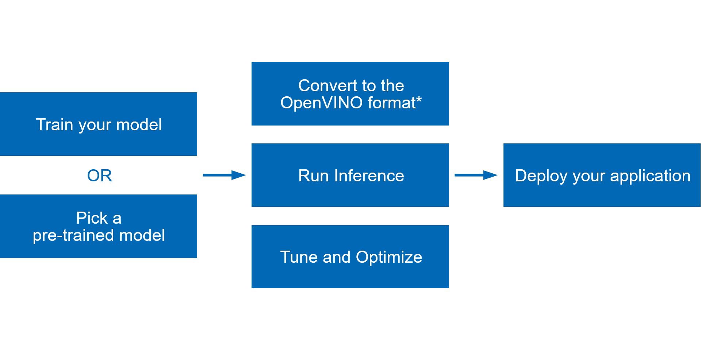
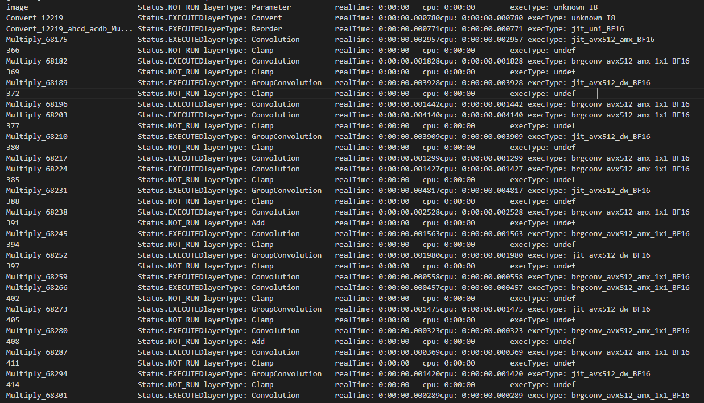
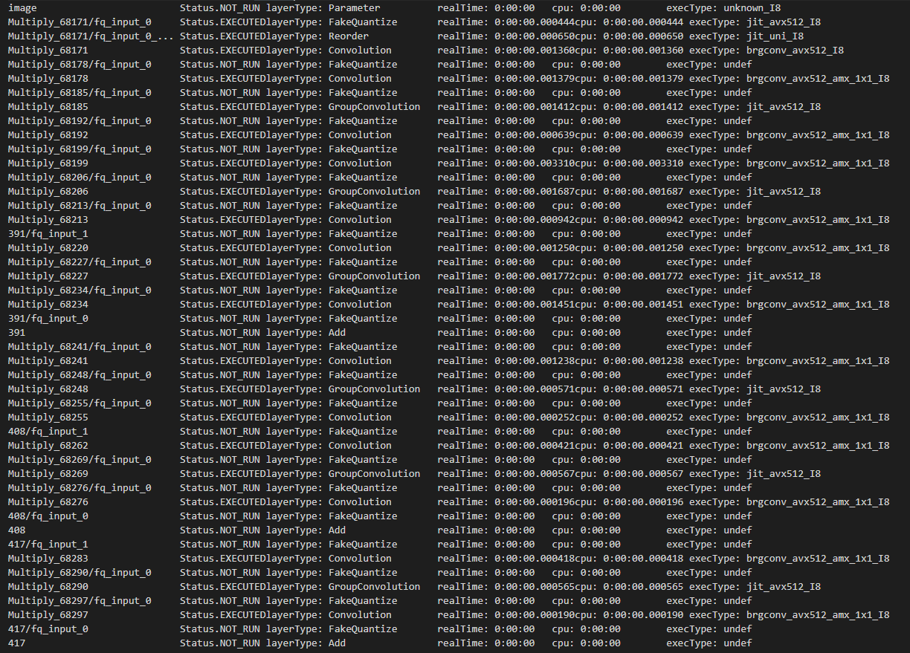

## Using Intel&reg; Distribution of OpenVINO&trade; Toolkit for Inference Acceleration

### Intel&reg; Distribution of OpenVINO&trade; Toolkit

OpenVINO™ is an open-source toolkit for optimizing and deploying AI inference with the following features:  
  
- Boost deep learning performance in computer vision, automatic speech recognition, natural language processing and other common tasks  
- Use models trained with popular frameworks like TensorFlow, PyTorch, and more  
- Reduce resource demands and efficiently deploy on a range of Intel® platforms from edge to cloud  

  
  
The scheme below illustrates the typical workflow for deploying a deep learning model that has been trained using OpenVINO™:  

- Train your model with popular frameworks like TensorFlow* and PyTorch*, or pick a pre-trained model from open model zoo.  
- Run Model Optimizer to perform static model analysis and produce an optimized Intermediate Representation (IR) of the model that can be inferred with OpenVINO™ Runtime. 
- Use OpenVINO Runtime API to read an Intermediate Representation (IR), ONNX, or PaddlePaddle model and execute it on preferred devices.  
- Tune and optimize the whole pipeline to improve final model performance by applying special optimization methods like quantization, pruning, preprocessing optimization, etc.  
- Once everything is done, [deploy your application with OpenVINO™](https://docs.openvino.ai/latest/openvino_deployment_guide.html)  
  
For more information, refer to OpenVINO™ online documentation: <https://docs.openvino.ai/latest/index.html>

### Enable BFLOAT16/INT8 Inference with Intel® Deep Learning Boost

The default floating-point precision of a CPU primitive is f32. On platforms that natively support bfloat16 calculations with AVX512_BF16 or AMX_BF16 extensions, the bf16 type is automatically used instead of f32.  This will achieve better performance.  See the [BFLOAT16 – Hardware Numerics Definition white paper](https://www.intel.com/content/dam/develop/external/us/en/documents/bf16-hardware-numerics-definition-white-paper.pdf) for more details about the bfloat16 format.  

Using bf16 precision provides the following performance benefits:

- Faster multiplication of two bfloat16 numbers because of the shorter mantissa of the bfloat16 data.  
- Reduced memory consumption since bfloat16 data size is two times smaller than 32-bit float.  

To check whether a CPU device can support the bfloat16 data type, use the [openvino.runtime.Core.get_property](https://docs.openvino.ai/latest/api/ie_python_api/_autosummary/openvino.runtime.Core.html#openvino.runtime.Core.get_property) to query the [ov::device::capabilities](https://docs.openvino.ai/latest/groupov_runtime_cpp_prop_api.html#doxid-group-ov-runtime-cpp-prop-api-1gadb13d62787fc4485733329f044987294) property.  It should contain BF16 in the list of CPU capabilities as shown below:
  
    core = Core()
    cpu_optimization_capabilities = core.get_property("CPU", "OPTIMIZATION_CAPABILITIES")
   
Use the benchmark_app to check whether BF16/I8 is enabled when running inference:

- [Install OpenVINO™ Development Tools](https://docs.openvino.ai/latest/openvino_docs_install_guides_install_dev_tools.html) and [Install OpenVINO™ Runtime](https://docs.openvino.ai/latest/openvino_docs_install_guides_install_runtime.html)
- BFloat16
  - Download FP32 model from open model zoo (or pick your own FP32 model), download [horizontal-text-detection-0001](https://docs.openvino.ai/latest/omz_models_model_horizontal_text_detection_0001.html) here as an example:  
`omz_downloader --name horizontal-text-detection-0001 --precisions FP32 -o .`  
  - Run benchmark app with -pc  
`benchmark_app -m ./intel/horizontal-text-detection-0001/FP32/horizontal-text-detection-0001.xml -pc`  
  - We can see some kernels are running with BF16 precison with both avx512 and amx instructions.  

- INT8
  - Download INT8 model from open model zoo (or pick your own INT8 model), download [horizontal-text-detection-0001](https://docs.openvino.ai/latest/omz_models_model_horizontal_text_detection_0001.html) here as an example:  
`omz_downloader --name horizontal-text-detection-0001 --precisions FP16-INT8 -o .`  
  - Run benchmark app with -pc  
`benchmark_app -m ./intel/horizontal-text-detection-0001/FP16-INT8/horizontal-text-detection-0001.xml -pc`  
  - We can see some kernels are running with I8 precison with both avx512 and amx instructions.  

**Notes**  
  
Due to the reduced mantissa size of the bfloat16 data type, the resulting bf16 inference accuracy may differ from the f32 inference, especially for models that were not trained using the bfloat16 data type. If the bf16 inference accuracy is not acceptable, switch to the f32 precision.

C++:

	ov::Core core;
	core.set_property("CPU", ov::hint::inference_precision(ov::element::f32));

Python:

	core = Core()
	core.set_property("CPU", {"INFERENCE_PRECISION_HINT": "f32"})
	
If you use the benchmark_app, set -infer_precision to f32, for example:  

`benchmark_app -m ./intel/horizontal-text-detection-0001/FP32/horizontal-text-detection-0001.xml -pc -infer_precision f32`
