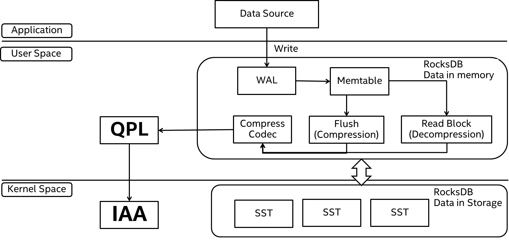
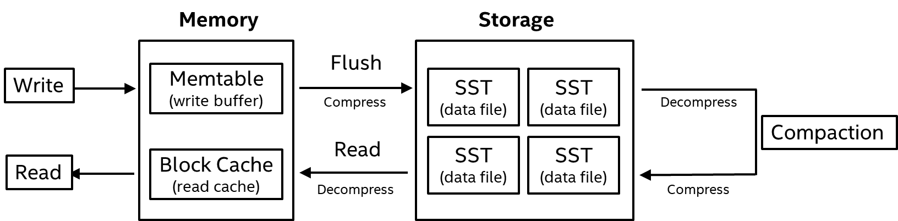
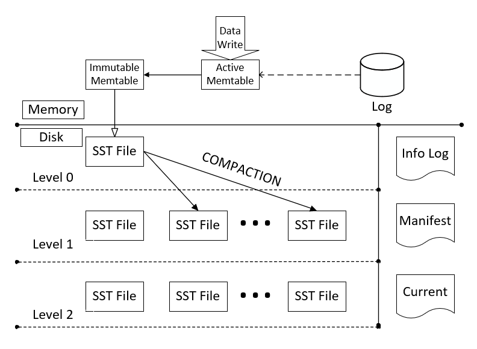
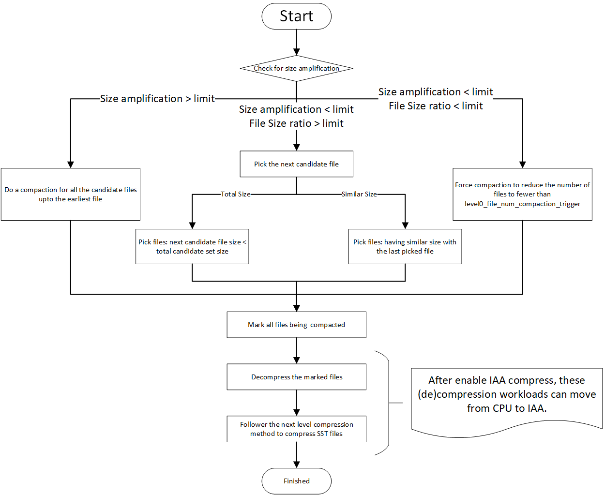

# RocksDB (De)compression by IAA Tuning Guide on Intel® Xeon® Scalable Processors

[TOC]

## Introduction

This guide is targeted towards users who are already familiar with RocksDB and provides pointers and system setting for hardware and software that will provide the best performance for most situations. However, please note that we rely on the users to carefully consider these settings for their specific scenarios since RocksDB can be deployed in multiple ways and this is a reference to one such use case.

4th Gen Intel® Xeon® Scalable processors deliver industry-leading, workload-optimized platforms with built-in AI acceleration, providing a seamless performance foundation to help speed data’s transformative impact, from the multi-cloud to the intelligent edge and back. Improvements of particular interest to this workload application are: 

- Enhanced Performance
- Reduce memory and disk utilization
- Support for Intel® In-Memory Analytics Accelerator (Intel® IAA)

### Server Configuration

#### Hardware

The configuration described in this article is based on 4th Generation Intel® Xeon® processor hardware. The server platform, memory, hard drives, and network interface cards can be determined according to your usage requirements.

| Hardware      | Model                                         |
| ------------- | --------------------------------------------- |
| CPU           | Intel® SPR E3 stepping, base Frequency 1.6GHz |
| BIOS          | EGSDCRB1.SYS.0085.D15.2207241333              |
| Memory        | 1024GB (16x64GB 4800MT/s [4800MT/s])          |
| Storage/Disks | Intel® Optane™ SSD DC P5800X Series           |

#### Software

| Software         | Version                                     |
| ---------------- | ------------------------------------------- |
| Operating System | CentOS Stream 8                             |
| Kernel           | 5.18 or later                               |
| GCC Version      | gcc (GCC) 8.5.0 20210514 (Red Hat 8.5.0-15) |
| GLIBC Version    | ldd (GNU libc) 2.28                         |
| Binutils Version | GNU ld version 2.36.1-3.el8                 |

### Introduction to RocksDB

RocksDB started as an experimental Facebook project intended to develop a database product for high-workload services, which is comparable in data storage performance to a fast data storage system, flash memory in particular. RocksDB utilizes major source code from the open-source project, LevelDB*, as well as foundational concepts from the Apache* HBase project. The source code can be sourced back to LevelDB 1.5 fork.

RocksDB supports various configurations and can be tuned for different production environments (memory only, Flash, hard disks, or HDFS). It also supports a range of data compression algorithms and tools for debugging in production environments. RocksDB is mainly designed for excellent performance in fast storage applications and high workload services. Therefore, this database system requires sufficient utilization of the read and write speeds of flash memory and RAM. RocksDB needs to support efficient "point lookup" and "range scan" operations, and configuration of various parameters for random read and write operations in high-workload services or for performance tuning in case of heavy read and write traffic.

For more information on RocksDB, visit the [RocksDB wiki](https://github.com/facebook/rocksdb/wiki) page.

### Introduction to IAA(Intel In-memory Analytics Accelerator)

#### Introduction

Focused on data analytics operations ( Decompress, Compress, Filter )

- 2x – 4x usable memory capacity
- Lower CPU Utilization ( (de)compression and analytics/SQL offload )
- Lower power consumption
- Use cases
  - Memory caching (Memcached/Redis)
  - In memory databases and analytics ( Apache SQL / Cassandra )
  - In Storage select ( Amazon S3 )
  - In SSD analytics etc.


In this RocksDB tunning feature, IAA (De)compression is enabled in RocksDB to optimize data access performance and storage.

## Hardware Tuning

This guide targets the usage of RocksDB on 4th Gen Intel Xeon Scalable processors with Intel® In-Memory Analytics Accelerator (Intel® IAA). 

IAA 1.0 Technical Specification has already been public disclosure and published on February 2022. The spec passed all technical and BU approvals and is being processed for further publication on [Intel SDM website](https://www.intel.com/content/www/us/en/developer/articles/technical/intel-sdm.html).

[Intel® In-Memory Analytics Accelerator Architecture Specification](https://cdrdv2.intel.com/v1/dl/getContent/721858)

### BIOS Setting

Begin by resetting your BIOS to default setting, then change the default values to the below suggestions:

| Configuration Item            | Recommended Value       |
| ----------------------------- | ----------------------- |
| Hyper-Threading               | Enable                  |
| Hardware Prefetcher           | Enable                  |
| L2 RFO Prefetch Disable       | Disable                 |
| Adjacent Cache Prefetch       | Enable                  |
| DCU Streamer Prefetcher       | Enable                  |
| DCU IP Prefetcher             | Enable                  |
| LLC Prefetch                  | Enable                  |
| Total Memory Encryption (TME) | Disable                 |
| SNC (Sub NUMA)                | Disable                 |
| UMA-Based Clustering          | Hemisphere (2-clusters) |
| Boot performance mode         | Max Performance         |
| Turbo Mode                    | Enable                  |
| Hardware P-State              | Native Mode             |
| Local/Remote Threshold        | Auto                    |

### IAA Setting

**accel-config** is a user-space tool for controlling and configuring IAA hardware devices.

**How to install accel-config tool**, please refer to *https://github.com/intel/idxd-config*

List all the active DSA devices discovered by the driver and the driver exported attributes.

```
accel-config list
```

Below is the script to enable 1 IAA device, configure IAA work queues and engines resources:

```shell
#Enable 1 IAA devices
for ((i=1;$i<=1;i=$i+2)) # modify this value to enable different number of IAA devices
do
    echo $i
    accel-config config-engine iax$i/engine$i.0 -g 0
    accel-config config-engine iax$i/engine$i.1 -g 0
    accel-config config-engine iax$i/engine$i.2 -g 0
    accel-config config-engine iax$i/engine$i.3 -g 0
    accel-config config-engine iax$i/engine$i.4 -g 0
    accel-config config-engine iax$i/engine$i.5 -g 0
    accel-config config-engine iax$i/engine$i.6 -g 0
    accel-config config-engine iax$i/engine$i.7 -g 0
    accel-config config-wq iax$i/wq$i.0 -g 0 -s 128 -p 10 -b 1 -d user -t 128 -m shared -y user -n iax_crypto
    accel-config enable-device iax$i
    accel-config enable-wq iax$i/wq$i.0
done
```

Below is IAA device configuration output:

```
[
  {
    "dev":"iax1",
    "max_groups":4,
    "max_work_queues":8,
    "max_engines":8,
    "work_queue_size":128,
    "numa_node":0,
    "op_cap":[
      "0xd",
      "0x7f331c",
      "0",
      "0"
    ],
    "gen_cap":"0x71f10901f0105",
    "version":"0x100",
    "state":"enabled",
    "max_batch_size":1,
    "max_transfer_size":2147483648,
    "configurable":1,
    "pasid_enabled":1,
    "cdev_major":235,
    "clients":0,
    "groups":[
      {
        "dev":"group1.0",
        "traffic_class_a":1,
        "traffic_class_b":1,
        "grouped_workqueues":[
          {
            "dev":"wq1.0",
            "mode":"shared",
            "size":128,
            "group_id":0,
            "priority":10,
            "block_on_fault":1,
            "max_batch_size":32,
            "max_transfer_size":2097152,
            "cdev_minor":0,
            "type":"user",
            "name":"iax_crypto",
            "driver_name":"user",
            "threshold":128,
            "ats_disable":0,
            "state":"enabled",
            "clients":0
          }
        ],
        "grouped_engines":[
          {
            "dev":"engine1.0",
            "group_id":0
          },
          {
            "dev":"engine1.1",
            "group_id":0
          },
          {
            "dev":"engine1.2",
            "group_id":0
          },
          {
            "dev":"engine1.3",
            "group_id":0
          },
          {
            "dev":"engine1.4",
            "group_id":0
          },
          {
            "dev":"engine1.5",
            "group_id":0
          },
          {
            "dev":"engine1.6",
            "group_id":0
          },
          {
            "dev":"engine1.7",
            "group_id":0
          }
        ]
      },
      {
        "dev":"group1.1",
        "traffic_class_a":1,
        "traffic_class_b":1
      },
      {
        "dev":"group1.2",
        "traffic_class_a":1,
        "traffic_class_b":1
      },
      {
        "dev":"group1.3",
        "traffic_class_a":1,
        "traffic_class_b":1
      }
    ]
  }
]
```

### Network Configuration

In the application scenario of RocksDB, since performance is usually limited by the bandwidth of the network rather than the performance of memory and persistent memory, running Redis across the network requires a large network card bandwidth (the larger, the better), which is recommended to be above 10GB/s.

## Software Tuning

Software configuration tuning is essential. From the Operating System to RocksDB configuration settings, they are all designed for general-purpose applications and default settings are almost never tuned for the best performance.

### Linux Kernel Optimization Settings

#### CPU Configuration

- Configure the CPU to the performance mode

```shell
cpupower -c <cpulist> frequency-set --governor performance
```

- Configure the energy/performance bias

```shell
x86_energy_perf_policy performance
```

- Configure the minimum value for the processor P-State

```shell
echo 100 > /sys/device/system/cpu/intel_pstate/min_perf_pct
```

#### Kernel Settings

- Configure the corresponding CPU core parameters

```sh
sysctl -w kernel.sched_domain.cpu<x>.domain0.max_newidle_lb_cost=0

sysctl -w kernel.sched_domain.cpu<x>.domain1.max_newidle_lb_cost=0
```

- Configure the scheduling granularity

```sh
sysctl -w kernel.sched_min_granularity_ns=10000000

sysctl -w kernel.sched_wakeup_granularity_ns=15000000
```

- Configure the virtual memory parameters

```sh
sysctl -w vm.dirty_ratio = 40

sysctl -w vm.swappiness = 10

sysctl -w vm.dirty_background_ratio=10
```

### RocksDB Architecture

RocksDB is a storage engine library of key-value store interfaces where keys and values are arbitrary byte streams and implemented based on the LSM-Tree algorithm.

RocksDB writes process: data is added to Write-Ahead Log (WAL) first for every insert or update, then it is inserted into Memtable for sorting. If the Memtable is already full, it will be converted to an immutable Memtable, and the data is refreshed as the SST file to level 0 in the back end. Similarly, when one level is full, "compaction" is triggered in the back end, which takes the data in the SST file and merges it with a higher-level SST file with an overlapping key range. The merged data takes the new SST file and writes it to a higher level, while the expired data is discarded. Since the higher level is 10 times larger than the lower level, compaction will cause serious write amplification and occupy a large amount of storage bandwidth. This is the main performance issue with LSM trees.

A Read operation starts with a Memtable search. Then a level-by-level search is performed in the SST files until the block data is found. If the block data is already in the block cache, the data is read directly from the cache (cache hit). Otherwise, the data is loaded onto the block cache from the SST file and read (cache miss). Block data is the smallest unit of I/O for a read operation and is usually larger than a key-value pair. Therefore, there will be a certain degree of reading amplification.


### RocksDB Tuning

#### Installing OneTBB

```shell
# TBB
# Download offline installer from https://www.intel.com/content/www/us/en/developer/articles/tool/oneapi-standalone-components.html#onetbb
# If there are other oneAPI products installed in another directory, --install-dir selection will fail
if [[ $install_tbb == "true" ]]; then
  ./$tbb_file -a -s --eula accept --install-dir ./oneapi
  export LD_LIBRARY_PATH=$(pwd)/oneapi/tbb/latest/lib/intel64/gcc4.8
else
  export LD_LIBRARY_PATH=$tbb_install_dir/lib/intel64/gcc4.8
fi
```

#### Installing QPL

```sh
# QPL
if [[ $use_git == "true" ]]; then
  git clone --recursive --branch v0.1.21 https://github.com/intel/qpl.git qpl_source
else
  unzip $qpl_file
  mv $qpl_file_dir qpl_source
fi
cd qpl_source
mkdir build
cd build
cmake -DCMAKE_INSTALL_PREFIX=../../qpl -DCMAKE_BUILD_TYPE=Release -DEFFICIENT_WAIT=ON ..
cmake --build . --target install -- -j
cd ../..
```

#### Installing gflags

```sh
# gflags
# CentOS doesn't offer v2.2, required by latest RocksDB
# Comment out this section if your system includes gflags v2.2 already
if [[ $install_gflags == "true" ]]; then
  git clone https://github.com/gflags/gflags.git
  cd gflags
  git checkout tags/v2.2.2
  mkdir build && cd build
  cmake -DCMAKE_INSTALL_PREFIX=/usr -DBUILD_SHARED_LIBS=ON .. 
  make
  make install
  ldconfig
  cd ../..
fi
```

#### Installing Other Dependent Libraries

- **snappy**

```
yum install snappy snappy-devel
```

- **zlib**

```
yum install zlib zlib-devel
```

- **bzip2**

```
yum install bzip2 bzip2-devel
```

- **lz4**

```
yum install lz4-devel
```

- **zstandard:**

```
wget https://github.com/facebook/zstd/archive/v1.1.3.tar.gz
mv v1.1.3.tar.gz zstd-1.1.3.tar.gzzxvf zstd-1.1.3.tar.gz
cd zstd-1.1.3
make && make install
```

- **memkind**

memkind v1.10.0 or above is required to build the block cache allocator. For more information on memkind, refer to the [GitHub memkind page](https://github.com/memkind/memkind).

```
yum --enablerepo=PowerTools install memkind-devel
```

### Compiling RocksDB

#### Download intel rocksdb which supports IAA Compress

git clone --branch pluggable_compression https://github.com/lucagiac81/rocksdb.git

#### Download IAA Compressor

git clone https://github.com/intel/iaa-plugin-rocksdb.git plugin/iaa_compressor

#### Build RocksDB with IAA Compressor

```sh
EXTRA_CXXFLAGS="-I/home/user/wangpeng/qpl_19/include -I/home/user/wangpeng/qpl_19/include/qpl -I/usr/local/include" EXTRA_LDFLAGS="-L/home/user/wangpeng/qpl_19/lib64 -L/home/user/wangpeng/oneapi/tbb/latest/lib/intel64/gcc4.8 -L/usr/local/lib -Lgflags" ROCKSDB_CXX_STANDARD="c++17" DISABLE_WARNING_AS_ERROR=1 ROCKSDB_PLUGINS="iaa_compressor" LIB_MODE=shared make -j release
```

### Create a new RocksDB Compression with IAA/QPL

- **RocksDB Compression**

RocksDB supports many compressions LZ4, SNAPPY, ZSTD, and ZLIB. RocksDB uses them to compress a data block. 

- **Intel® QPL**

Intel® QPL is aimed to support capabilities of the new Intel® In-Memory Analytics Accelerator (Intel® IAA) available on Next Generation Intel® Xeon® Scalable processors, codenamed Sapphire Rapids processor, such as very high throughput compression and decompression combined with primitive analytic functions, as well as to provide highly-optimized SW fallback on other Intel CPUs. 

- **A new compression of IAA/QPL**

Create a new RocksDB compressor with QPL API, which is used to enable IAA to compress/decompress. This new compressor has the same way to use as other compressions.

- **RocksDB with IAA/QPL Architecture**



### Read&Write Optimization in RocksDB



#### Write Optimization

In RocksDB, the Writing operation inserts data to the Memtable first, and then these data will be compressed according to the Block into an SST file.  The compressed performance significantly impacts writing efficiency. IAA has efficient compression/decompression, and it can speed up writing performance. It moves the compression load from the CPU to IAA and reduces CPU utilization.

#### Read Optimization

If the Reading operation doesn't search the Key from Block Cache, it needs to decompress the SST compressed Block. Decompression performance significantly impacts reading efficiency. According to the laboratory data, after enabling IAA decompression the reading performance has much improved compared with ZSTD (CPU) compression.

### Compaction Optimization in RocksDB



Below is the Compaction flowchart, every compaction process contains compression and decompression which have a significant impact on compactions. After enable IAA compress, it can improve compaction performance and reduce CPU utilization.



## Conclusion

The combination of RocksDB, 4th Generation Intel Xeon Scalable processor, and Intel IAA is a very practical way to use RocksDB. The large dataset of compression needs a high compress ratio compress method, and IAA supplies this suitable compression way. It can get very good performance, while it can be conveniently used in customers' environment. IAA (De)compression has been created as a pluggable compressor, and it has no code change in customer's environment.

If customer use RocksDB + IAA in MySQL or Redis, it can get better performance compared with ZSTD (CPU) compression, and better storage saving compared with LZ4 (CPU) compression. In the performance experiment, after enabling IAA compression, the compression hotspot significantly drops the data accessing workload compared with other compressions. Meanwhile, RocksDB + IAA can save much MySQL buffer size while keeping the same throughput with ZSTD (CPU) compression.

IAA compression also has better throughput than ZSTD (CPU) compression, and it can supply better performance in data writing workloads.

As mentioned in the Facebook RocksDB introduction, RocksDB provides better data flashing and data compressing in reading, writing, and storing data workloads. IAA (De)compress function can improve these functions.

## Feedback

We value your feedback. If you have comments (positive or negative) on this guide or are seeking something that is not part of this guide, [please reach out](https://community.intel.com/t5/Software-Tuning-Performance/bd-p/software-tuning-perf-optimization) and let us know what you think.